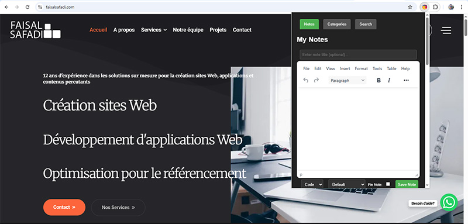
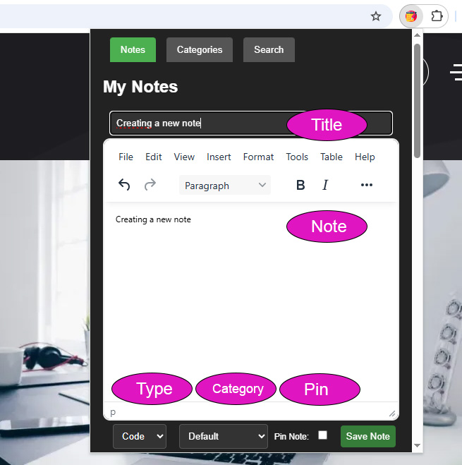
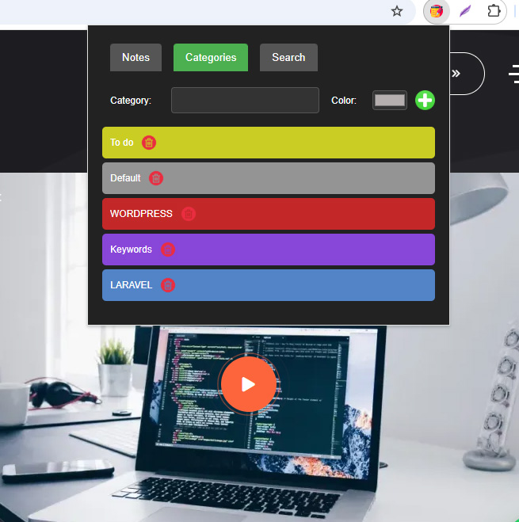
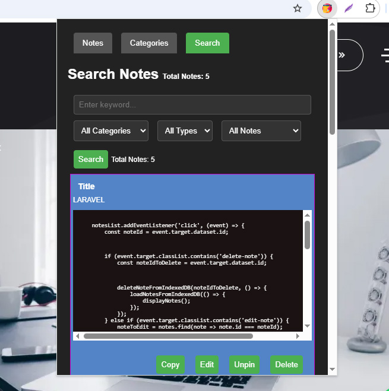
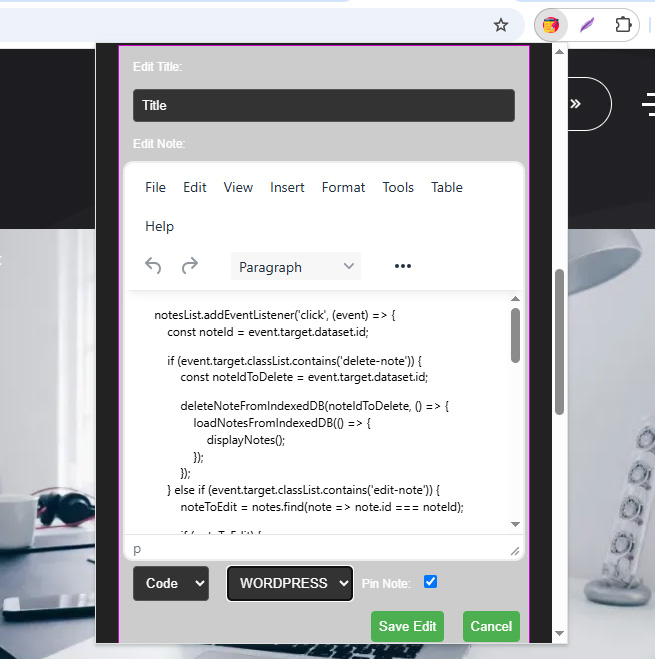

# My Dev Notes

 
Your Personal Development Knowledge Base

##My Dev Notes is a Chrome extension designed to help developers efficiently store, organize, and access their code snippets, notes, and resources. Keep your valuable coding knowledge at your fingertips.
 
## Features

*   Effortless Note-Taking: Quickly capture code snippets, text notes, links, and images directly within your browser.
*   Flexible Categorization: Organize your notes using customizable categories with color-coding for easy visual identification.
*   Rich Text Editing: Format your notes with a WYSIWYG editor (Quill) to create well-structured and readable content.
*   Code Highlighting: Enjoy syntax highlighting for code snippets, making them easier to read and understand.
*   Pin Important Notes: Pin your most frequently used notes to the top of the list for quick access.
*   Powerful Search: Easily find the notes you need with keyword search and category filtering.
*   Copy to Clipboard: Quickly copy note content to your clipboard with a single click.
*   Edit Notes: Change or add information to your notes.
*   Multiple Type Support: Handle text code links and images for all your note taking needs

## Screenshots

*   **Creating a new note:**
    
*   **Organizing notes with categories:**
    
*   **Searching for specific notes:**
    
*   **Editing the code source:**
    

## Installation

You can install My Dev Notes in two ways:

*   **From the Chrome Web Store (Recommended):**
    *   Easy installation and automatic updates.
    *   Install My Dev Notes from the [Chrome Web Store](https://chrome.google.com/webstore/detail/your-extension-id).

*   **From Source Code (for advanced users and developers):**
    *   Great control and access to the source code.
    1.  Download the source code from the [Releases page](https://github.com/faisalsafadi/my-dev-notes/releases) or [my web site](http://faisalsafadi.com/wp-content/uploads/2025/03/my-dev-notes.crx).
    2.  Open Chrome and navigate to `chrome://extensions`.
    3.  Enable "Developer mode" in the top right corner.
    4.  Click "Load unpacked" and select the directory where you extracted the extension files.

## Usage

1.  Click the My Dev Notes icon in your Chrome toolbar.
2.  Use the text area and formatting options to create a new note.
3.  Select a type (Code, Text, Link, Image) and category for your note.
4.  Click "Save Note" to add the note to your collection.
5.  Use the tabs to switch between Notes, Categories, and Search views.
6.  Use the search bar to find the notes, and edit using the button.

## Contributing

We welcome contributions to My Dev Notes! If you have any suggestions, bug reports, or feature requests, please open an issue or submit a pull request.

1.  Fork the repository.
2.  Create a new branch for your feature or bug fix.
3.  Make your changes and commit them with descriptive messages.
4.  Submit a pull request.

## Author

*   **Faisal Safadi**
    *   Email: [faisalsafadi@gmail.com](mailto:faisalsafadi@gmail.com)
    *   Website: [faisalsafadi.com](https://faisalsafadi.com)

## License

This project is licensed under the MIT License - see the [LICENSE](LICENSE) file for details.

## Credits

*   This extension uses the following open-source libraries:
    *   [Quill](https://quilljs.com/): For the rich text editor.
    *   [Prism.js](https://prismjs.com/): For code syntax highlighting.
    *   [DOMPurify](https://github.com/cure53/DOMPurify): For HTML sanitization.
    *   [UUID](https://www.npmjs.com/package/uuid): For unique ID generation.

## Support

If you encounter any issues or have questions, please open an issue on GitHub.

---

Thank you for using My Dev Notes! We hope it helps you stay organized and productive.
